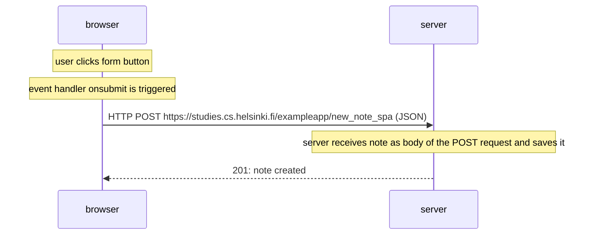

```mermaid
sequenceDiagram
participant browser
participant server
Note over browser: user clicks form button
Note over browser: event handler onsubmit is triggered
browser->>server: HTTP POST https://studies.cs.helsinki.fi/exampleapp/new_note_spa (JSON)
Note over server: server receives note as body of the POST request and saves it
server-->>browser: 201: note created

```