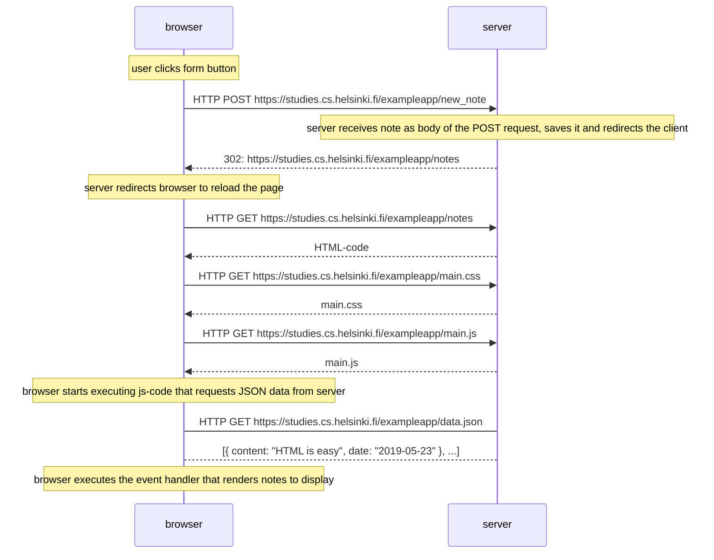

```mermaid
sequenceDiagram
participant browser
participant server
Note over browser: user clicks form button
browser->>server: HTTP POST https://studies.cs.helsinki.fi/exampleapp/new_note
Note over server: server receives note as body of the POST request, saves it and redirects the client
server-->>browser: 302: https://studies.cs.helsinki.fi/exampleapp/notes
Note over browser: server redirects browser to reload the page
browser->>server: HTTP GET https://studies.cs.helsinki.fi/exampleapp/notes
server-->>browser: HTML-code
browser->>server: HTTP GET https://studies.cs.helsinki.fi/exampleapp/main.css
server-->>browser: main.css
browser->>server: HTTP GET https://studies.cs.helsinki.fi/exampleapp/main.js
server-->>browser: main.js

Note over browser: browser starts executing js-code that requests JSON data from server 


browser->server: HTTP GET https://studies.cs.helsinki.fi/exampleapp/data.json
server-->browser: [{ content: "HTML is easy", date: "2019-05-23" }, ...]

Note over browser: browser executes the event handler that renders notes to display

```